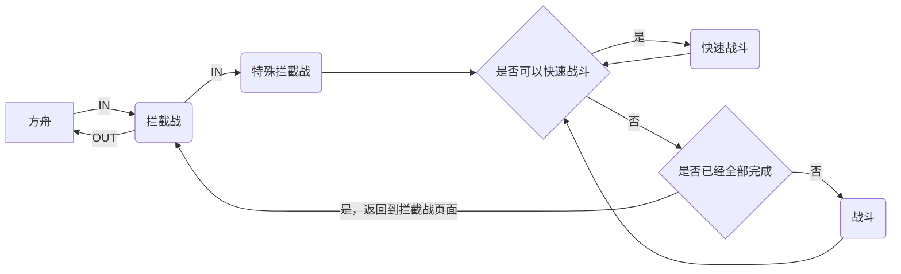
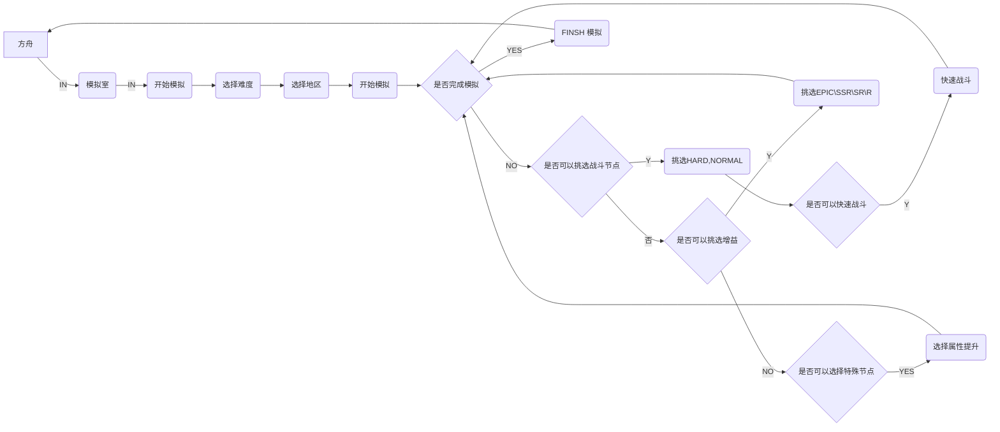

<!-- markdownlint-disable MD033 MD041 -->

<div align="center">

# MAA-NIKKE-Copilot 

</div>

## 已完成功能

- [x] 启动App进入大厅 
- [x] 拦截战

- [x] 模拟室

- [x] 每日友情点
- [x] 基地奖励

## 待完成功能

- [ ] 活动：完成战斗
- [ ] 领取邮箱奖励
- [ ] 无限之塔
- [ ] 前哨基地派遣
- [ ] 咨询
- [ ] 解放室

## 致谢

本仓库为 [MaaFramework](https://github.com/MaaXYZ/MaaFramework) 所提供的项目模板，开发者可基于此模板直接创建自己的 MaaXXX 项目。MaaFramework 的 [Release 包](https://github.com/MaaXYZ/MaaFramework/releases)，解压到 `deps` 文件夹中

  ```bash
    # 配置 git 信息（仅第一次需要，后续不用再配置）
    git config user.name "您的 GitHub 昵称"
    git config user.email "您的 GitHub 邮箱"
    
    # 提交修改
    git add .
    git commit -m "XX 新功能"
    git push origin HEAD -u
 cs
    # CI 检测到 tag 会自动进行发版
    git tag v1.0.0
    git push origin v1.0.0
```

调试工具：[MaaDebugger](https://github.com/MaaXYZ/MaaDebugger)
```
python -m MaaDebugger
```
```
#获取当前app包名
adb shell "dumpsys window w |grep \/ |grep name="

adb shell screencap -p /sdcard/screen.png
adb pull /sdcard/screen.png
```
